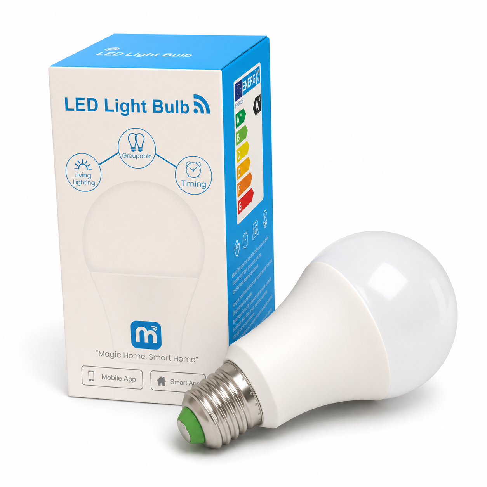

# homebridge-broadlink-lb1-local

[English](README.md) | **Русский**

Homebridge-плагин для полностью локального управления умными лампами BroadLink LB1.

Совместимые лампы управляются напрямую по локальной сети через UDP-протокол BroadLink. Для обычной работы **не нужны** BroadLink Cloud, Magic Home, учётная запись или Python.

> Python используется только в дополнительных скриптах для первоначальной настройки Wi-Fi и снятия LAN-блокировки.

## Совместимость



Плагин физически протестирован с лампой, показанной выше.

Подтверждённые данные устройства:

| Параметр | Значение |
|---|---|
| Класс устройства | `lb1` |
| Модель | `LB1` |
| Производитель | `Broadlink` |
| Product ID / devtype | `0x60C8` |
| Протестированная прошивка | `57231` |
| Протокол | BroadLink UDP, порт `80` |

У разных продавцов упаковка может отличаться. Надёжный способ проверить совместимость — убедиться, что при обнаружении лампа определяется как **класс `lb1` и devtype `0x60C8`**.

## Возможности

- аксессуар HomeKit `Lightbulb`
- включение и выключение
- яркость
- оттенок и насыщенность
- цветовая температура
- локальный опрос состояния
- автоматический поиск ламп в локальной сети
- ручная настройка устройств
- стабильный HomeKit UUID на основе MAC-адреса
- повторная авторизация после сетевых ошибок и потери сессии
- watchdog keepalive для прошивки лампы
- поддержка нескольких ламп
- отсутствие облачной зависимости при обычной работе

## Установка

После публикации пакета в npm его можно будет установить через интерфейс Homebridge, найдя:

```text
homebridge-broadlink-lb1-local
```

или из командной строки:

```bash
npm install -g homebridge-broadlink-lb1-local
```

После установки перезапустите Homebridge.

## Подготовка лампы

Перед использованием в Homebridge лампу необходимо подключить к Wi-Fi и оставить разблокированной для локального LAN-доступа.

Скрипты из `scripts/` используют [`python-broadlink`](https://github.com/mjg59/python-broadlink) только на этапе первоначальной настройки.

### 1. Установите зависимости для вспомогательных скриптов

```bash
python3 -m venv .venv
. .venv/bin/activate
pip install -r scripts/requirements.txt
```

### 2. Переведите лампу в режим настройки

Сбросьте лампу до заводского состояния и переведите её в режим настройки Wi-Fi.

На протестированной LB1 этот режим отображается быстрым миганием.

Если лампа создаёт временную Wi-Fi сеть для настройки, подключите к ней компьютер, на котором запускается скрипт, прежде чем продолжать.

Если ваша цель — полностью локальное управление, не добавляйте лампу обратно в старые сторонние приложения без необходимости. Протестированная лампа после настройки через старое приложение Magic Home находилась в состоянии LAN-lock.

### 3. Передайте лампе параметры Wi-Fi

Запустите:

```bash
python scripts/setup_bulb.py "Имя вашей Wi-Fi сети"
```

Пароль будет запрошен отдельно и не будет отображаться в терминале.

При необходимости пароль можно передать явно:

```bash
python scripts/setup_bulb.py "Имя вашей Wi-Fi сети" --password "пароль-wifi"
```

Для другого поддерживаемого режима безопасности:

```bash
python scripts/setup_bulb.py "Имя вашей Wi-Fi сети" --security wpa1/2
```

После успешной настройки лампа должна выйти из setup mode и подключиться к вашей обычной Wi-Fi сети.

### 4. Найдите IP-адрес лампы

Посмотрите адрес в роутере/DHCP-таблице или найдите лампу любым удобным LAN-сканером.

Homebridge идентифицирует аксессуар по MAC-адресу, а не по IP. Поэтому последующая смена IP через DHCP не создаёт дубликат лампы в HomeKit.

### 5. Снимите блокировку локального управления

Запустите:

```bash
python scripts/unlock_lb1.py --ip 192.168.1.50
```

Замените `192.168.1.50` на реальный адрес вашей лампы.

Скрипт:

- обнаруживает лампу;
- выполняет локальную авторизацию;
- вызывает `set_lock(False)`;
- повторно обнаруживает устройство;
- проверяет, что `Locked` равен `False`;
- проверяет, что новая сессия может авторизоваться и прочитать состояние.

Сам Homebridge-плагин никогда намеренно не устанавливает `lock=true`.

## Настройка Homebridge

Пример:

```json
{
  "platform": "BroadlinkLB1Local",
  "name": "BroadLink LB1 Local",
  "discovery": true,
  "pollInterval": 10,
  "keepAliveInterval": 90,
  "devices": [
    {
      "name": "LB1 Lamp",
      "host": "192.168.1.50",
      "mac": "aa:bb:cc:dd:ee:ff"
    }
  ]
}
```

Устройства, добавленные вручную и найденные автоматически, объединяются по MAC-адресу и не создают дубликаты.

Можно использовать только автоматический поиск:

```json
{
  "platform": "BroadlinkLB1Local",
  "name": "BroadLink LB1 Local",
  "discovery": true,
  "devices": []
}
```

## Параметры конфигурации

| Параметр | По умолчанию | Описание |
|---|---:|---|
| `discovery` | `true` | Автоматически искать лампы при запуске |
| `discoveryTimeout` | `5` | Таймаут обнаружения в секундах |
| `pollInterval` | `10` | Интервал опроса состояния в секундах |
| `keepAliveInterval` | `90` | Интервал watchdog-ping в секундах; `0` отключает его |
| `commandTimeout` | `4` | Таймаут UDP-команды в секундах |
| `retries` | `2` | Максимальное число повторных попыток |
| `colorDebounceMs` | `100` | Задержка для объединения близких HomeKit-команд цвета |
| `devices` | `[]` | Список ламп, заданных вручную |

Пример ручной записи устройства:

```json
{
  "name": "LB1 Lamp",
  "host": "192.168.1.50",
  "mac": "aa:bb:cc:dd:ee:ff"
}
```

Дополнительно могут использоваться поля `port` и `devtype`.

## Решение проблем

### Лампа находится, но показывает `Locked: True`

Плагин не может авторизоваться в лампе с включённой LAN-блокировкой.

Сбросьте/перенастройте лампу и выполните:

```bash
python scripts/unlock_lb1.py --ip IP_ЛАМПЫ
```

### Лампа не находится автоматически

Убедитесь, что Homebridge и лампа находятся в одной локальной сети/VLAN и UDP broadcast не блокируется сетевым оборудованием.

Лампу также можно добавить вручную по IP и MAC-адресу.

### Лампа работала, но стала недоступна

Плагин автоматически повторяет сетевые запросы и заново авторизуется при необходимости.

Для прошивок с BroadLink watchdog по умолчанию отправляется keepalive-ping каждые 90 секунд.

### Цветовая температура

HomeKit использует mired, а протокол LB1 — Kelvin. Плагин преобразует значения автоматически.

В текущей реализации исходящая цветовая температура ограничена диапазоном `2700K..6500K`.

## Разработка

```bash
npm install
npm run build
npm run lint
npm test
```

Для локальной разработки с Homebridge:

```bash
npm link
homebridge -D
```

## Благодарности

Дополнительные скрипты первоначальной настройки используют [`python-broadlink`](https://github.com/mjg59/python-broadlink) — MIT-лицензированный проект для локального управления устройствами BroadLink.

Сам Homebridge-плагин общается с лампой напрямую из Node.js/TypeScript и не требует `python-broadlink` во время обычной работы.

## Протестированное оборудование

Физически проверенная конфигурация:

```text
BroadLink LB1
devtype:  0x60C8
firmware: 57231
```

Поддержку других ревизий ламп BroadLink следует считать неподтверждённой до проверки на реальном устройстве.
